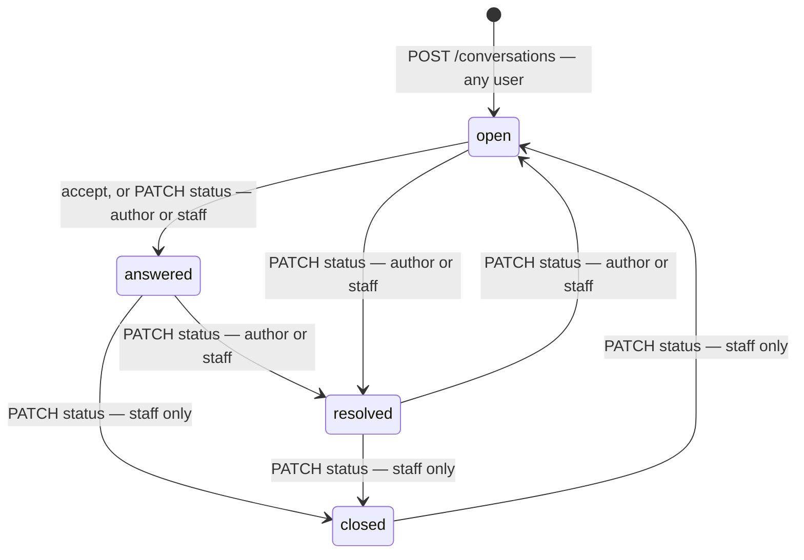
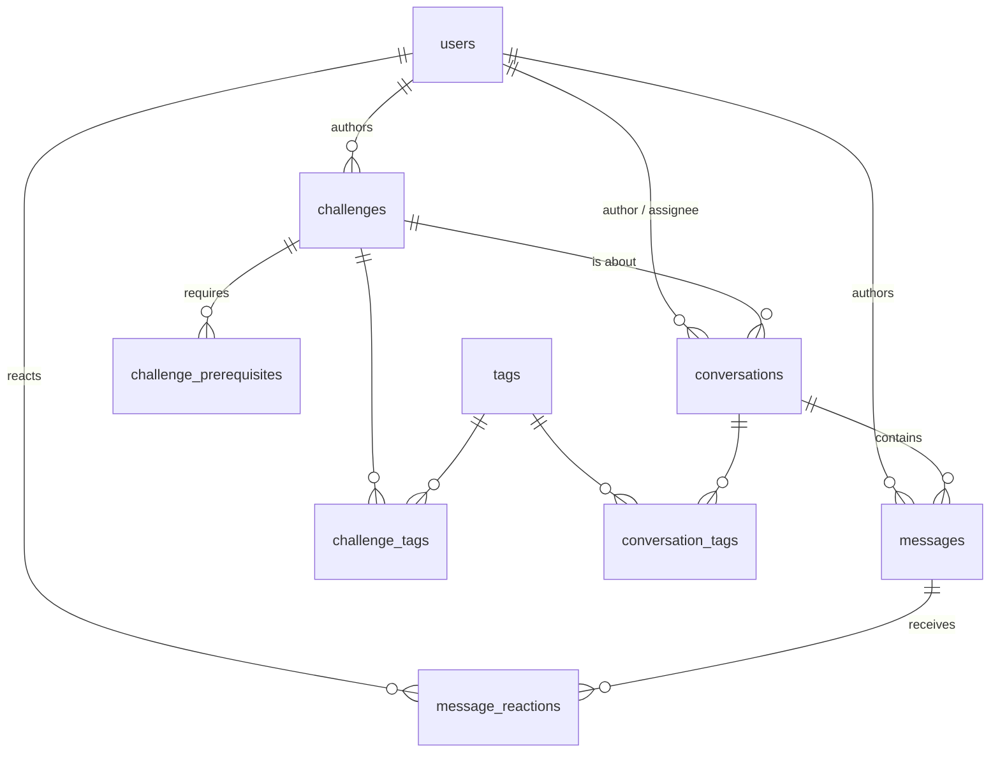

# PennyLane support platform

A community-driven support platform for PennyLane coding challenges: a learner opens a conversation
about a challenge, anyone in the community can reply, and the asker or the support team marks one
reply as the accepted answer. Existing answers stay browsable and filterable, so the next person
with the same problem finds it before opening a new thread. The support team's workflow — triage
queue, assignment, internal notes, moderation, insights — is a layer on top of that community
system, not the thing itself.

Python 3.12, FastAPI, SQLAlchemy 2.0 (sync), Alembic, Postgres 18. Built as a take-home.

## Setup

Docker is the only prerequisite; no `.env` is needed, since compose sets every default inline.

```sh
git clone <this repo> && cd pennylane-support && docker compose up --build
```

That builds the image, starts Postgres, waits for its healthcheck, migrates, seeds, and starts the
API. The seed loads `data/*.json` and ends by printing per-table row counts and a data-quality
report ([Data findings](#data-findings)); it skips itself once `conversations` has rows.

Docs are at <http://localhost:8000/docs>; <http://localhost:8000/health> returns
`{"status":"ok","database":"ok"}` only when the app can really reach Postgres, and `503
{"status":"degraded","database":"unavailable"}` when it cannot.

Postgres 18 keeps its data directory under `/var/lib/postgresql`, not `.../data` where pre-18 images
put it; the volume mounts there and `make reset` wipes it. `APP_PORT=8080 docker compose up` moves
the API, and Postgres is not published to the host at all. The project name is pinned to
`pennylane-support`; set `COMPOSE_PROJECT_NAME` to run two checkouts side by side.

Every target is one compose command, so `make` is a convenience and never a requirement:

| Target | Does | Raw equivalent |
|---|---|---|
| `make up` | build and start the stack | `docker compose up --build` |
| `make down` | stop it, keep the data | `docker compose down` |
| `make reset` | stop it, delete the volume | `docker compose down -v` |
| `make migrate` | migrate the running stack | `docker compose exec app alembic upgrade head` |
| `make seed` | seed it; `FORCE_SEED=1 make seed` re-runs over existing rows | `docker compose exec -e FORCE_SEED=1 app python -m app.seed.load` |
| `make test` | the test suite | `docker compose run --rm --entrypoint pytest app` |
| `make demo` | the asserted walkthrough | `bash scripts/walkthrough.sh` |
| `make logs` | follow the app log | `docker compose logs -f app` |
| `make psql` | a psql shell | `docker compose exec db psql -U pennylane -d pennylane` |

The entrypoint migrates, seeds, then `exec "$@"`, so `docker compose run --rm app <cmd>` gets a
prepared database. `make test` bypasses it with `--entrypoint pytest`: the tests prepare their own
database and must not touch the application one. `SKIP_SEED=1` skips the seed; `DEV=1` (set by
compose) starts uvicorn with `--reload`.

**Outside Docker.** Copy `.env.example` to `.env`, point `DATABASE_URL` at your own Postgres 18,
then:

```sh
pip install -r requirements.lock && pip install --no-deps -e .
alembic upgrade head
python -m app.seed.load          # loads data/*.json; FORCE_SEED=1 re-runs it
uvicorn app.main:app --reload
```

## Decisions

### Skipped Auth and Identification service

Authentication matters for a real forum, but I left it out for simplicity and kept the seam obvious.

Any request may carry `X-User: <handle>`. Any handle already in `users` is accepted with no password or token, and a staff handle grants staff rights purely because the row says `role IN ('support','staff')`. A handle naming nobody is `401` on every request, reads included: a typo must not degrade to anonymous, or a visibility test would pass for the wrong reason. Reads work without the header; writes require it. Verified identity would replace `get_current_user` in `app/deps.py`, and because authorization is keyed on `current_user.role`, the permission tests would not change.

### One table for Conversations

The source is a forum export with ticket fields attached, so one `conversations` table carries both shapes: the community side (accepted answer, reactions, pinning) and the support side (status, priority, assignee). Anyone can reply, the asker can mark the answer and resolve their own thread, and staff moderate. The data supports this: 75% of accepted answers come from learners and mentors, not staff.

### Concurrency for writes

Every mutation on a conversation takes `SELECT ... FOR UPDATE` on its row, then re-reads the state it depends on under the lock.

Every timestamp a write stores is `clock_timestamp()` taken after the lock, so a request that started earlier but got the lock later cannot write an older `last_activity_at`. The cost is that writes within one thread are serialized; optimistic locking is the upgrade when a support console needs to know someone else changed the record. Covered in `tests/test_concurrency.py` and `tests/test_lifecycle.py`.

### Single function to manage visibility

Every rule about who can see what lives in `app/visibility.py`: deleted rows only for staff who ask, internal messages only for staff, nothing visible if its conversation isn't. Reads, counts and every mutation resolve through it, so a learner who guesses an internal message id gets the same `404` from read, react and accept. `tests/test_visibility.py` checks each path.

### Infered from the given data

Ordering by `sequence_no`: 449 of the 800 threads have posts out of timestamp order, and `post_id` is the reading order. The model orders by it, the unique constraint backs it, and message paging is keyed on it.

Role on the user: 20 handles post under several roles. `_role_for` in `app/seed/load.py` takes each user's most frequent role, breaking ties toward lower privilege, and keeps the per-post value as `posted_as_role`. Insights read `users.role`.

`resolved_at` derived from `resolution_time_hours`: it disagrees with the post timestamps in all but one thread, which reads as "resolution happened after the last message".

### Rest over GraphQL

Opted for REST endpoints currently as we do not have clients with divergent needs. And utilised OpenAPI to document the surfaces.


## Next Steps

In the order they'd come:

1. Keyset pagination on the list endpoints.
2. Optimistic locking on PATCH, for a support console that needs to know someone else changed the record.
3. An events table so assignment and status history are queryable.
4. Flagging a post for moderation; saved threads; related conversations.
5. Full-text search over message bodies: "ansatz" appears in 248 threads and in zero topics, so topic search alone misses the vocabulary people actually use.
6. A spoiler wall, designed against the forum's own policy that staff give a push in the right direction rather than solutions.
7. Verified identity replacing `get_current_user`, with the authorization tests unchanged. Write quotas come with it: they were left out deliberately, since a cap keyed on a self-declared header stops nobody.
8. Lookup tables for status with `is_terminal`, and materialized insights once the dashboard query is slow enough to notice.

## Using the API

**Identity is a demo contract, not authentication.** 
Real authentication replaces one function, `deps.get_current_user`: verify a token, return the same `User` row; everything
downstream keys off `current_user.role`, so the permission tests would not change a line.
`quantum_learner42` is a seeded learner and `pennylane_support` seeded staff; both appear below.

| Endpoint | Who may call it |
|---|---|
| `GET /challenges` | anyone; non-staff see published only |
| `GET /challenges/{id}` | anyone; `404` to non-staff when not published |
| `GET /challenges/{id}/conversations` | anyone; also takes `unresolved=true` |
| `GET /conversations` | anyone; `unresolved=true` + `unassigned=true` + `sort=priority` is the support queue |
| `POST /conversations` | any user |
| `GET /conversations/{id}` | anyone (deleted: staff with `include_deleted`) |
| `PATCH /conversations/{id}` | author (status only, not closed/locked) or staff (any field) |
| `DELETE /conversations/{id}` | staff |
| `POST /conversations/{id}/restore` | staff |
| `GET /conversations/{id}/messages` | anyone |
| `POST /conversations/{id}/messages` | any user; `is_internal` staff only |
| `DELETE /conversations/{id}/messages/{mid}` | staff |
| `POST /conversations/{id}/messages/{mid}/accept` | conversation author or staff |
| `POST` / `DELETE /conversations/{id}/messages/{mid}/reactions[/{type}]` | any user; DELETE removes own |
| `GET /tags` | anyone |
| `GET /users` | staff |
| `POST /users` | anyone, no header needed |
| `GET /insights` | staff |
| `GET /health` | anyone |

```sh
curl 'localhost:8000/challenges?difficulty=Beginner&limit=5'                 # browse by difficulty
curl localhost:8000/conversations/1                                          # read a thread
curl 'localhost:8000/conversations/1/messages?after_sequence=50&limit=50'    # page past its first 50
curl -H 'X-User: pennylane_support' \
  'localhost:8000/conversations?sort=priority&unassigned=true&unresolved=true&limit=10'  # the support queue
curl -X POST -H 'X-User: quantum_learner42' -H 'Content-Type: application/json' \
  -d '{"type":"helpful"}' localhost:8000/conversations/1/messages/2/reactions   # react to a reply
curl -X POST -H 'X-User: quantum_learner42' \
  localhost:8000/conversations/1/messages/2/accept                           # accept it as the answer
curl -H 'X-User: pennylane_support' localhost:8000/insights                  # the staff dashboard
```

`make demo` runs the whole path — create, reply, internal note, react, accept, assign, resolve,
close, delete, restore, refusals — asserting every status code and field.

## Conversation lifecycle



`resolved` and `closed` are terminal. `resolved_at` is set only on a non-terminal → terminal
transition: `resolved → closed` preserves it, reopening clears it, resolving again sets a new one,
so resolution metrics measure the resolution that stuck. **Accept** marks one message and moves
`open → answered`; it resolves nothing — `answered` means "replied to", `has_accepted` means
"solved". Accepting another message replaces the previous one in the same transaction, and a partial
unique index guarantees at most one per conversation; the opening message and an internal note can
never be accepted (`422`), and a locked conversation refuses (`409`). **Locked** means no new posts,
not no reactions — reacting and un-reacting both still succeed. **Delete is soft and idempotent** (a
second `DELETE` is also `204`), **restore** returns the thread with its accepted answer intact, and
a deleted message keeps its `sequence_no` so the gap shows instead of the thread renumbering.

## Visibility

One predicate, in `app/visibility.py`, in two forms — a Python check for a loaded row and SQLAlchemy
criteria for a query — and every read *and* every mutation resolves its target through it, so "not
visible" is `404` everywhere rather than `403` in some places and a leak in others. Anonymous
callers and learners see non-deleted, non-internal messages on non-deleted conversations; staff also
see internal notes, and see soft-deleted rows only when they ask with `include_deleted=true`. A
message id that exists but belongs to another conversation is `404` on the nested path, a message is
never visible when its conversation is not, and writes against a soft-deleted conversation are `404`
to non-staff and `409 "restore first"` to staff. Counts follow the caller, so a learner never sees a
total the page contradicts.

## Schema



`users` handle and role. `tags` the shared vocabulary. `challenges` the catalogue, keeping the
source `external_id` (`CHAL_0xx`). `challenge_tags` and `challenge_prerequisites` join challenges to
tags and to each other. `conversations` one thread: `external_id` (`CONV_0801` onward once created
through the API), status, priority, assignee, soft-delete column. `messages` ordered by
`sequence_no`, never `created_at`, because the imported timestamps are disordered.
`message_reactions` one row per (user, message, type), enforcing one reaction per person while the
imported `upvotes`/`helpful_count` aggregates stay on the message, and `conversation_tags` joins
threads to tags.

CHECK invariants: role and `posted_as_role` in the four roles; challenge `difficulty` and `status`;
conversation `status` and `priority`; reaction `type`; `challenge_id <> prerequisite_id`; and on
messages `sequence_no >= 1`, `upvotes >= 0 AND helpful_count >= 0`, `NOT (is_accepted AND
sequence_no = 1)`, `NOT (is_accepted AND is_internal)`.

| Index | Serves |
|---|---|
| `conversations (last_activity_at DESC, id DESC)` | the default list sort |
| `conversations (created_at DESC, id DESC)` | `sort=newest` |
| `conversations (status, created_at DESC)` | status-filtered lists |
| `conversations (challenge_id, created_at DESC)` | a challenge's threads |
| `conversations (assignee_id, created_at) WHERE resolved_at IS NULL AND deleted_at IS NULL` | one assignee's open work — **not** the unassigned queue; see `NOTES-docs.md` |
| `messages (conversation_id, sequence_no)` unique | ordering, the next sequence number, and the page-scoped aggregate |
| `messages (conversation_id) UNIQUE WHERE is_accepted` | at most one accepted answer |
| `messages (author_id, created_at)` | per-author lookups |
| `message_reactions (message_id)`, `challenge_tags (tag_id)`, `conversation_tags (tag_id)` | reverse joins |

## Data findings

The seed reports these on every run. Counts are from the shipped data.

| Anomaly | Definition | Count | What the seed does |
|---|---|---|---|
| Points coerced | `points` arrived as a string (`CHAL_022` is `"225"`) | 1 | Coerces to int, logs a WARNING with the external id |
| Non-monotonic posts | A post's timestamp precedes its predecessor's | 449 | Keeps them; orders messages by `post_id`, never by time |
| Last post before first | The last post predates the opening post | 61 | Keeps them; counts them |
| Resolution before last post | `created_at + resolution_time_hours` < the last post | 19 | Stores `resolved_at` as given; the metric reports it |
| Multi-role users | One handle posts under more than one role | 20 | Takes the most frequent role, ties to the lower privilege |
| Threads on unpublished challenges | Conversation about a draft/archived challenge | 116 | Keeps them visible, with the challenge status attached |
| Thread before its challenge | Conversation `created_at` < challenge `created_at` | 39 | Keeps them; counts them |
| Unpublished prerequisite | A published challenge requires a draft/archived one | 16 | Keeps them; counts them |

Four source fields are dropped as derivable, and because they would go stale the moment the API is
used: `description` (the opening post's body), `participants` and `participant_count` (distinct
message authors), and `updated_at` (`last_activity_at` carries it).

## Metrics

`GET /insights`, staff only. A **reply** is a non-internal, non-deleted message whose author differs
from the conversation's author — a self-reply is a follow-up, and the 111 in the seed are reported
separately as `asker_follow_ups` rather than dropped. Provenance is the author's **current**
`users.role`, and internal notes are excluded everywhere: a note the asker cannot read is neither a
reply nor an answer. All eight sections run in **one transaction at REPEATABLE READ**, so a reply
landing mid-request cannot be counted by one section and missed by the next.

| Section | Decision it supports | Denominator | Exclusions | Limitation |
|---|---|---|---|---|
| `community` | Is the community self-sustaining, or is staff carrying it? | All visible replies (2150) and accepted answers (357) | Internal, deleted, self-replies | Current role, so a promotion rewrites history |
| `top_contributors` | Who to thank, promote to mentor, or ask to review | Per-user accepted answers; helpful received (legacy + live) | Internal, deleted | Imported aggregates cannot be attributed to a person |
| `knowledge_coverage` | Which published challenges still have no answer to point at | 102 published challenges | Unpublished challenges; internal, deleted | An accepted answer is not necessarily a *good* answer |
| `challenge_load` | Which challenge generates support load per attempt | Conversations per 1000 attempts, `NULLIF(attempt_count, 0)` | Challenges with no recorded attempts sort last | Attempt counts are a snapshot, not a time series |
| `first_reply` | How long a learner waits before anyone answers | 593 conversations with a non-negative delta | 140 negative deltas (disordered import), 67 with no reply | Measures first contact, not resolution |
| `backlog` | What to staff next, by status and priority | Non-terminal conversations | Terminal, deleted | A snapshot, with no ageing |
| `resolution` | How long a thread takes to reach a terminal state | 425 terminal conversations with a `resolved_at` | Non-terminal, deleted | Measures the *latest* resolution after a reopen |
| `data_quality` | Whether the import can be trusted before reading the rest | All visible conversations | Deleted | Recounts live; the seed's report is import-time |

The per-attempt floor: the smallest `attempt_count` is 44 and the largest 4179, so no
`challenge_load` rate rests on a tiny denominator. If that changed, the rule would be to suppress
challenges under ~50 attempts rather than let a 2-attempt one top the table.

## Tests

`make test` — pytest in a one-off container against `pennylane_test`, a second database
`docker/initdb.sql` creates with the volume. `conftest.py` refuses to run unless `DATABASE_URL_TEST`
names a `*_test` database, then drops the schema, migrates, seeds once per session and overrides
`get_db`, so **a test run never touches the application database**: drop the application schema, run
the suite, and it passes with that database still empty.

| File | The invariant it proves |
|---|---|
| `test_seed.py` | The seed is idempotent, and a re-seed never overwrites a status set through the API |
| `test_lifecycle.py` | `open → answered → resolved → closed`; `resolved_at` is set once and survives closing; a closed or locked thread refuses |
| `test_visibility.py` | Internal notes, foreign message ids and soft-deleted rows are `404`, and counts follow the caller |
| `test_accepted.py` | One accepted answer, replaceable in both directions, cleared by deletion, enforced by the index |
| `test_concurrency.py` | Ten simultaneous replies number themselves 2..11; the reply that waited for the lock carries the later timestamp |
| `test_insights.py` | The seeded totals exactly, and that one new community reply moves exactly one number |
| `test_ids.py` | `CONV_` formatting past four digits, and that an API create keeps id and external id in step |
| `test_moderation.py` | Delete and restore are idempotent, and a deleted message stays deleted across a restore |

The event-time test in `test_concurrency.py` drives the write handler directly with two sessions
rather than over HTTP, because lock order cannot be made deterministic through the client.
`test_insights.py` reseeds from scratch because its numbers are absolute, making it the slow one. Tag ordering follows the database collation — `en_US.utf8` ignores hyphens at the primary
level, so `parameters` sorts before `parameter-shift` while Python's `sorted()` does the opposite; a
test about tag order must use SQL as its oracle, never `sorted()`.

## Known limitations

- **Identity is a self-declared header.** Anyone can claim any handle, staff included, and `POST /users` is
  open. A demo contract; see [Using the API](#using-the-api).
- **Offset pagination is stable only for a fixed dataset.** Writes between two requests can shift an
  item across a page boundary; message paging is keyset (`after_sequence`), so new replies never
  move a page already read.
- **Event times are taken after the row lock** (`clock_timestamp()`, not `now()`), so a thread's
  `last_activity_at` is the latest committed change and can be later than the start of the request
  that caused it — deliberate, since it keeps activity from walking backwards under a lock wait.
- **Conversations about unpublished challenges stay visible** to everyone (116 of them), with the
  challenge's status attached so a client can label them; only the challenge detail is gated.
- **Community metrics use the author's current role**, so promoting a mentor to staff changes
  yesterday's community share; `posted_as_role` is stored, so a role-at-the-time variant needs no
  migration.
- **Writes within one thread serialize on its row lock**, which is what makes sequence numbers
  gapless and accept last-write-wins. A very active thread is the trigger to revisit; p95 reply
  latency under contention is the measurement.
- **`view_count` is an imported snapshot and does not change.** A write on every GET would make the
  endpoint non-idempotent and lock the hottest threads; a real view count is an events table.
