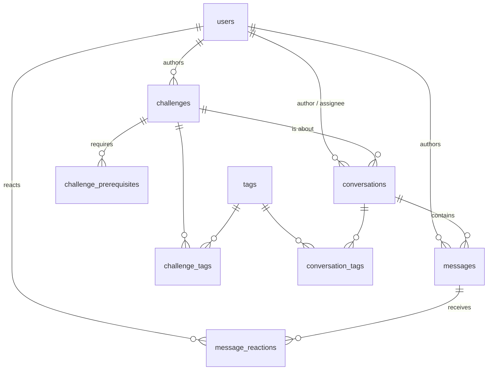

# PennyLane support platform

A community-driven support platform for PennyLane coding challenges: a learner opens a conversation
about a challenge, anyone in the community can reply, and the asker or the support team marks one
reply as the accepted answer. Existing answers stay browsable and filterable, so the next person
with the same problem finds it before opening a new thread. The support team's workflow (triage
queue, assignment, internal notes, moderation, insights) is a layer on top of that community
system, not the thing itself.

Python 3.12, FastAPI, SQLAlchemy 2.0 (sync), Alembic, Postgres 18. Built as a take-home.

## Setup

Docker is the only prerequisite; no `.env` is needed.

```sh
git clone <this repo> && cd pennylane-support && docker compose up --build
```

That builds the image, starts Postgres, migrates, seeds from `data/*.json` and starts the API.
The seed prints per-table row counts and a data-quality report ([Data findings](#data-findings)),
and skips itself once `conversations` has rows.

- API docs: <http://localhost:8000/docs>
- `/health` returns `503` when Postgres is unreachable.

| Target | Does |
|---|---|
| `make up` | build and start the stack |
| `make down` | stop it, keep the data |
| `make reset` | stop it, delete the volume |
| `make seed` | re-run the seed; `FORCE_SEED=1 make seed` re-runs over existing rows |
| `make test` | the test suite, against its own database |
| `make demo` | the asserted end-to-end walkthrough (needs curl and jq on the host) |
| `make psql` | a psql shell |

Outside Docker: see `.env.example`, then `alembic upgrade head`, `python -m app.seed.load`,
`uvicorn app.main:app`.

## Decisions

### Auth left out, identity stubbed

Authentication matters for a real forum, but I left it out for simplicity and kept the seam obvious.

Any request may carry `X-User: <handle>`. Any handle already in `users` is accepted with no
password or token, and a staff handle grants staff rights purely because the row says
`role IN ('support','staff')`. A handle naming nobody is `401` on every request, reads included: a
typo must not degrade to anonymous, or a visibility test would pass for the wrong reason. Reads
work without the header; writes require it. Verified identity would replace `get_current_user` in
`app/deps.py`, and because authorization is keyed on `current_user.role`, the permission tests
would not change.

### One table for conversations

The source is a forum export with ticket fields attached, so one `conversations` table carries both
shapes: the community side (accepted answer, reactions, pinning) and the support side (status,
priority, assignee). Anyone can reply, the asker can mark the answer and resolve their own thread,
and staff moderate. The data supports this: 75% of accepted answers come from learners and mentors,
not staff.

### One row lock for writes

Every mutation on a conversation takes `SELECT ... FOR UPDATE` on its row, then re-reads the state
it depends on under the lock. Every timestamp a write stores is `clock_timestamp()` taken after the
lock, so a request that started earlier but got the lock later cannot write an older
`last_activity_at`. The cost is that writes within one thread are serialized; optimistic locking is
the upgrade when a support console needs to know someone else changed the record. Covered in
`tests/test_concurrency.py` and `tests/test_lifecycle.py`.

### One function for visibility

Every rule about who can see what lives in `app/visibility.py`: deleted rows only for staff who
ask, internal messages only for staff, nothing visible if its conversation isn't. Reads, counts and
every mutation resolve through it, so a learner who guesses an internal message id gets the same
`404` from read, react and accept. `tests/test_visibility.py` checks each path.

### Inferred from the data

Ordering by `sequence_no`: 449 of the 800 threads have posts out of timestamp order, and `post_id`
is the reading order. The model orders by it, the unique constraint backs it, and message paging is
keyed on it.

Role on the user: 20 handles post under several roles. `_role_for` in `app/seed/load.py` takes each
user's most frequent role, breaking ties toward lower privilege, and keeps the per-post value as
`posted_as_role`. Insights read `users.role`.

`resolved_at` derived from `resolution_time_hours`: it disagrees with the post timestamps in all
but one thread, which reads as "resolution happened after the last message".

### REST over GraphQL

No clients with divergent field needs yet, so REST: each endpoint controls its own query shape, and
OpenAPI documents the surface for free at `/docs`. The schema is the part that would transfer to a
GraphQL layer.

## Next steps

In the order they'd come:

1. Keyset pagination on the list endpoints.
2. Optimistic locking on PATCH, for a support console that needs to know someone else changed the record.
3. An events table so assignment and status history are queryable.
4. Flagging a post for moderation; saved threads; related conversations.
5. Full-text search over message bodies: "ansatz" appears in 248 threads and in zero topics, so topic search alone misses the vocabulary people actually use.
6. A spoiler wall, designed against the forum's own policy that staff give a push in the right direction rather than solutions.
7. Verified identity replacing `get_current_user`, with the authorization tests unchanged. Write quotas come with it: they were left out deliberately, since a cap keyed on a self-declared header stops nobody.
8. Lookup tables for status with `is_terminal`, and materialized insights once the dashboard query is slow enough to notice.
9. A message-specific URL for the reply `Location` header, plus tests for replies beyond the first page of a thread and for a blocked lock wait.

## Using the API

`X-User: <handle>` is a demo identity, not authentication (see [Decisions](#decisions)).
`quantum_learner42` is a seeded learner and `pennylane_support` seeded staff.

| Endpoint | Who may call it |
|---|---|
| `GET /challenges` | anyone; non-staff see published only |
| `GET /challenges/{id}` | anyone; `404` to non-staff when not published |
| `GET /challenges/{id}/conversations` | anyone; also takes `unresolved=true` |
| `GET /conversations` | anyone; `unresolved=true` + `unassigned=true` + `sort=priority` is the support queue |
| `POST /conversations` | any user |
| `GET /conversations/{id}` | anyone (deleted: staff with `include_deleted`) |
| `PATCH /conversations/{id}` | author (status only, not closed/locked) or staff (any field) |
| `DELETE /conversations/{id}` | staff |
| `POST /conversations/{id}/restore` | staff |
| `GET /conversations/{id}/messages` | anyone |
| `POST /conversations/{id}/messages` | any user; `is_internal` staff only |
| `DELETE /conversations/{id}/messages/{mid}` | staff |
| `POST /conversations/{id}/messages/{mid}/accept` | conversation author or staff |
| `POST` / `DELETE /conversations/{id}/messages/{mid}/reactions[/{type}]` | any user; DELETE removes own |
| `GET /tags` | anyone |
| `GET /users` | staff |
| `POST /users` | anyone, no header needed |
| `GET /insights` | staff |
| `GET /health` | anyone |

Browse by difficulty, read a thread, page its messages:

```sh
curl 'localhost:8000/challenges?difficulty=Beginner&limit=5'
curl localhost:8000/conversations/193
curl 'localhost:8000/conversations/193/messages?after_sequence=10&limit=5'
```

The support queue, as staff:

```sh
curl -H 'X-User: pennylane_support' \
  'localhost:8000/conversations?sort=priority&unassigned=true&unresolved=true&limit=10'
```

React to a reply, accept one (`open` becomes `answered`), read the dashboard:

```sh
curl -X POST -H 'X-User: quantum_learner42' -H 'Content-Type: application/json' \
  -d '{"type":"helpful"}' localhost:8000/conversations/1/messages/2/reactions
curl -s -X POST -H 'X-User: quantum_learner42' \
  localhost:8000/conversations/319/messages/1169/accept | jq .status
curl -H 'X-User: pennylane_support' localhost:8000/insights
```

## Conversation lifecycle


- `resolved` and `closed` are terminal. `resolved_at` is set only on a non-terminal to terminal
  transition: `resolved` to `closed` preserves it, reopening clears it, resolving again sets a new
  one, so resolution metrics measure the resolution that stuck.
- **Accept** marks one message and moves `open` to `answered`; it resolves nothing. `answered`
  means "replied to", `has_accepted` means "solved". Accepting another message replaces the
  previous one; a partial unique index guarantees at most one per conversation. The opening
  message and an internal note can never be accepted (`422`); a locked conversation refuses (`409`).
- **Locked** means no new posts, not no reactions.
- **Deletes are soft.** Restore returns the thread with its accepted answer intact.

## Visibility

One predicate in `app/visibility.py`, in two forms: a Python check for a loaded row and SQLAlchemy
criteria for a query. Every read and every mutation resolves its target through it, so "not
visible" is `404` everywhere, never `403` in some places and a leak in others. Anonymous callers
and learners see non-deleted, non-internal messages on non-deleted conversations; staff also see
internal notes, and soft-deleted rows only with `include_deleted=true`. Counts follow the caller,
so a learner never sees a total the page contradicts.

## Schema



| Table | Worth knowing |
|---|---|
| `conversations` | one thread; `external_id` is `CONV_0801` onward once created through the API; soft-deleted via `deleted_at` |
| `messages` | ordered by `sequence_no`, never `created_at`, because the imported timestamps are disordered |
| `message_reactions` | one row per (user, message, type), so one reaction per person; the imported `upvotes` and `helpful_count` aggregates stay on the message |

| Index | Serves |
|---|---|
| `conversations (last_activity_at DESC, id DESC)` | the default list sort |
| `conversations (created_at DESC, id DESC)` | `sort=newest` |
| `conversations (status, created_at DESC)` | status-filtered lists |
| `conversations (challenge_id, created_at DESC)` | a challenge's threads |
| `conversations (assignee_id, created_at) WHERE resolved_at IS NULL AND deleted_at IS NULL` | unresolved threads by assignee, including the unassigned queue with `unresolved=true` |
| `messages (conversation_id, sequence_no)` unique | ordering, the next sequence number, and the page-scoped aggregate |
| `messages (conversation_id) UNIQUE WHERE is_accepted` | at most one accepted answer |
| `messages (author_id, created_at)` | per-author lookups |
| `message_reactions (message_id)`, `challenge_tags (tag_id)`, `conversation_tags (tag_id)` | reverse joins |

## Data findings

The seed reports these on every run. Counts are from the shipped data.

| Anomaly | Definition | Count | What the seed does |
|---|---|---|---|
| Points coerced | `points` arrived as a string (`CHAL_022` is `"225"`) | 1 | Coerces to int, logs a WARNING with the external id |
| Non-monotonic posts | A post's timestamp precedes its predecessor's | 449 | Keeps them; orders messages by `post_id`, never by time |
| Last post before first | The last post predates the opening post | 61 | Keeps them; counts them |
| Resolution before last post | `created_at + resolution_time_hours` < the last post | 19 | Stores `resolved_at` as given; the metric reports it |
| Multi-role users | One handle posts under more than one role | 20 | Takes the most frequent role, ties to the lower privilege |
| Threads on unpublished challenges | Conversation about a draft/archived challenge | 116 | Keeps them visible, with the challenge status attached |
| Thread before its challenge | Conversation `created_at` < challenge `created_at` | 39 | Keeps them; counts them |
| Unpublished prerequisite | A published challenge requires a draft/archived one | 16 | Keeps them; counts them |

Four source fields are dropped as derivable: `description` (the opening post's body),
`participants` and `participant_count` (distinct message authors), and `updated_at`
(`last_activity_at` carries it).

## Metrics

`GET /insights`, staff only. A **reply** is a non-internal, non-deleted message whose author differs
from the conversation's author; the 111 asker follow-ups in the seed are reported separately as
`asker_follow_ups`. Provenance is the author's current `users.role`. All eight sections run in one
transaction at `REPEATABLE READ`, so a reply landing mid-request cannot be counted by one section
and missed by the next.

| Section | Decision it supports | Denominator | Exclusions | Limitation |
|---|---|---|---|---|
| `community` | Is the community self-sustaining, or is staff carrying it? | All visible replies (2150) and accepted answers (357) | Internal, deleted, self-replies | Current role, so a promotion rewrites history |
| `top_contributors` | Who to thank, promote to mentor, or ask to review | Per-user accepted answers; helpful received (legacy + live) | Internal, deleted | Imported aggregates cannot be attributed to a person |
| `knowledge_coverage` | Which published challenges still have no answer to point at | 102 published challenges | Unpublished challenges; internal, deleted | An accepted answer is not necessarily a *good* answer |
| `challenge_load` | Which challenge generates support load per attempt | Conversations per 1000 attempts, `NULLIF(attempt_count, 0)` | Challenges with no recorded attempts sort last | Attempt counts are a snapshot, not a time series |
| `first_reply` | How long a learner waits before anyone answers | 593 conversations with a non-negative delta | 140 negative deltas (disordered import), 67 with no reply | Measures first contact, not resolution |
| `backlog` | What to staff next, by status and priority | Non-terminal conversations | Terminal, deleted | A snapshot, with no ageing |
| `resolution` | How long a thread takes to reach a terminal state | 425 terminal conversations with a `resolved_at` | Non-terminal, deleted | Measures the *latest* resolution after a reopen |
| `data_quality` | Whether the import can be trusted before reading the rest | All visible conversations | Deleted | Recounts live; the seed's report is import-time |

The smallest `attempt_count` is 44 and the largest 4179, so no `challenge_load` rate rests on a
tiny denominator. If that changed, the rule would be to suppress challenges under ~50 attempts.

## Tests

`make test` runs pytest against `pennylane_test`, a second database created with the volume.
`conftest.py` refuses to run unless `DATABASE_URL_TEST` names a `*_test` database, then migrates,
seeds once per session and overrides `get_db`, so a test run never writes to the application
database.

| File | The invariant it proves |
|---|---|
| `test_seed.py` | The seed is idempotent, and a re-seed never overwrites a status set through the API |
| `test_lifecycle.py` | `open` to `answered` to `resolved` to `closed`; `resolved_at` is set once and survives closing; a closed or locked thread refuses |
| `test_visibility.py` | Internal notes, foreign message ids and soft-deleted rows are `404`, and counts follow the caller |
| `test_accepted.py` | One accepted answer, replaceable in both directions, cleared by deletion, enforced by the index |
| `test_concurrency.py` | Ten simultaneous replies number themselves 2..11; the reply that waited for the lock carries the later timestamp |
| `test_insights.py` | The seeded totals exactly, and that one new community reply moves exactly one number |
| `test_ids.py` | `CONV_` formatting past four digits, and that an API create keeps id and external id in step |
| `test_moderation.py` | Delete and restore are idempotent, and a deleted message stays deleted across a restore |

## Known limitations

- Identity is a self-declared header; anyone can claim any handle, and `POST /users` is open.
- Offset pagination is stable only for a fixed dataset; message paging is keyset and is not affected.
- Event times are taken after the row lock, so `last_activity_at` can be later than the start of
  the request that caused it.
- Conversations about unpublished challenges stay visible (116 of them), with the challenge status
  attached; only the challenge detail is gated.
- Community metrics use the author's current role; `posted_as_role` is stored for a
  role-at-the-time variant.
- Writes within one thread serialize on its row lock; p95 reply latency under contention is the
  trigger to revisit.
- `view_count` is an imported snapshot and does not change.
